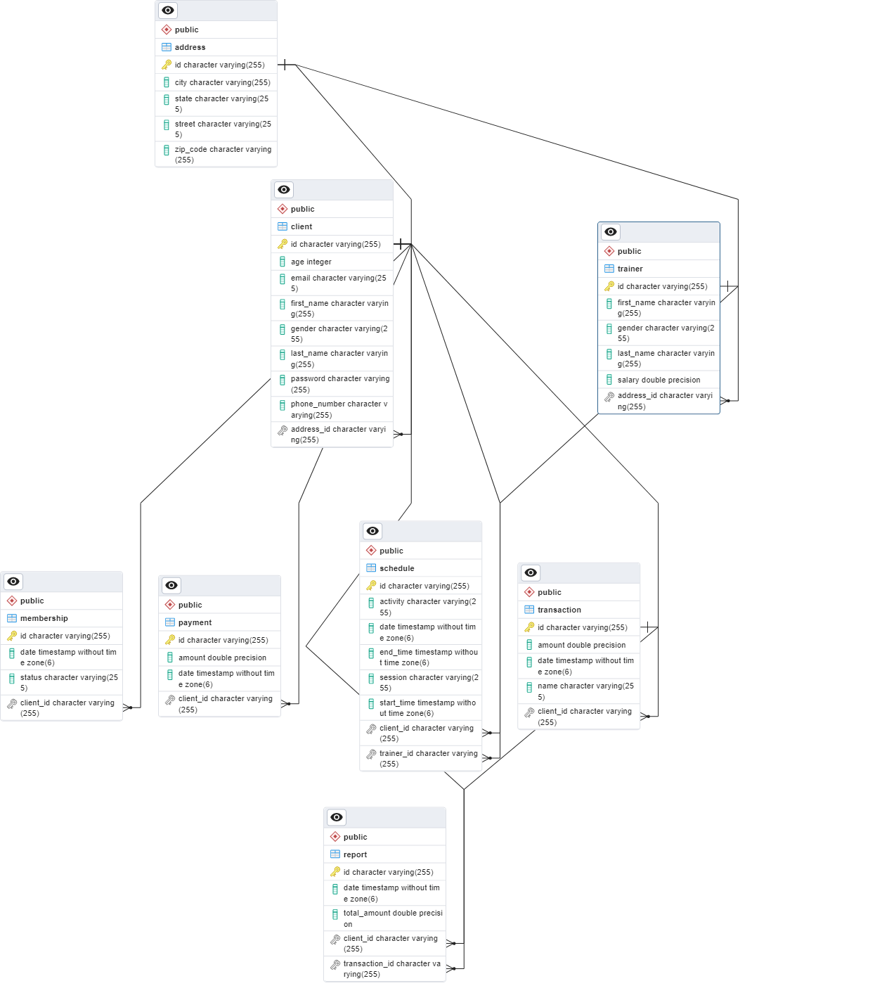

# GYM Management System

## Description

This is a simple GYM Management System that allows you to manage your GYM members and trainers. Simple CRUD operations are performed on the members and trainers. 

## Getting Started

### Prerequisites

* Java 17
* Maven
* Kotlin
* Postgres SQL

### Installing

* Clone the repository
* Open the project in your favorite IDE
* Run `mvn clean install` to build the project
* Create a database named `GymManagementSystem` in Postgres